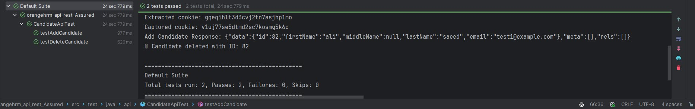

# OrangeHRM API Testing (Rest-Assured)

### A simple api scenario by rest assured

This project contains API automation tests for the OrangeHRM Demo Site using Rest-Assured and TestNG.
It demonstrates how to:
- Login via API
- Add a new candidate
- Delete a candidate

🚀 How to run

- Clone the repository  ```git clone https://github.com/AliAhmed3/orangehrm_api_rest_Assured.git```
- Install dependencies ```mvn clean install```
- run by ```mvn clean test```

# 📷 Results
<div>
 
 </div>
